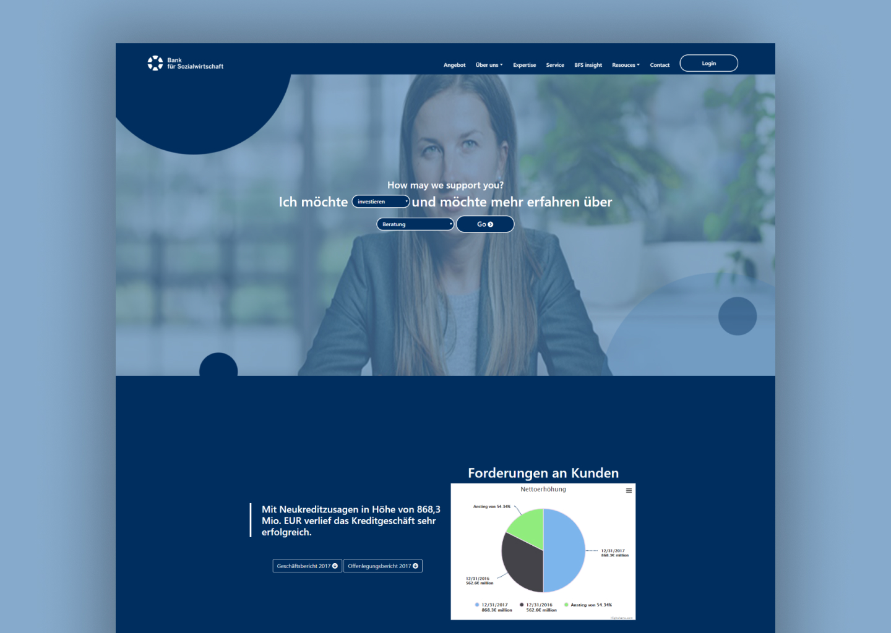
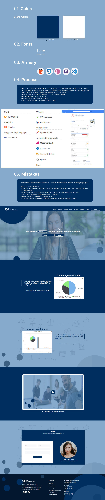

### Redesign-Insignio-Task

<br />
<p align="center">
  <a href="https://m90khan.github.io/Redesign-Insignio-Task/dist/index.html">
    
  </a>

  <h3 align="center">Insignio   </h3>

  <p align="center"> Website redesign challenge
<br />
    <a href="m90khan@gmail.com"><strong>Contact Me</strong></a>
    <br />
    <br />
    <a href="https://m90khan.github.io/Redesign-Insignio-Task/dist/index.html">View Demo</a>
    
   </p>
</p>

## Table of Contents

- [About the Project](#about-the-project)
- [Process](#process)
- [Skills](#skills)
- [Code Snippet](#code)
- [Connect With Me](#Contact)

### About the Project

- Redesigning and Implementation for a job interview task

Technologies Used: HTML5, CSS3, JavaScript ES6, WebPAck, NPM, Babel, Polyfill, Highcharts, Bootstrap
MVC architecture(Model View Controller)

Live: https://m90khan.github.io/Redesign-Insignio-Task/dist/index.html

Duration: 8 hrs (2 days split)



---

#### Process

- First, I read all the requirements in the email which after some days I realized were not sufficient.
- I started the research by looking at the current website to clear questions of what technologies they are using? how the site is ranked? what needed to be improved? etc.
- I set up the environment for the final CSS that will be compiled
- Implementation of HTML structure
- Applied styling along with high-charts.
- Sent an email with a complete status confirmation



---

### Skills

[][youtube]
[][youtube]
[][youtube]
[][youtube]
[][youtube]
[][youtube]
[][youtube]
<br />
<br />

---

### Code Snippet

```javascript
Highcharts.chart('container', {
  chart: {
    styledMode: true,
  },

  title: {
    text: 'Nettoerhöhung',
  },

  xAxis: {
    categories: [
      'Jan',
      'Feb',
      'Mar',
      'Apr',
      'May',
      'Jun',
      'Jul',
      'Aug',
      'Sep',
      'Oct',
      'Nov',
      'Dec',
    ],
  },

  series: [
    {
      type: 'pie',
      allowPointSelect: true,
      keys: ['name', 'y', 'selected', 'sliced'],
      data: [
        ['12/31/2017 <br> 868.3€ million ', 868.3, false],
        ['12/31/2016 <br> 562.6€ million', 562.6, false],
        ['Anstieg von 54.34%', 305.7, false],
      ],
      showInLegend: true,
    },
  ],
});
```

---

### Connect with me:

[][youtube]

[][twitter]
[][linkedin]
[][instagram]
[][behance]
[][dribble]
<br />

---

[youtube]: https://www.youtube.com/channel/UC96rVfdTKsjZpREnH6CaCOw
[twitter]: https://twitter.com/m90khan
[linkedin]: https://www.linkedin.com/in/uxdkhan
[instagram]: https://www.instagram.com/uxd.khan/
[behance]: https://www.behance.net/Khan_Mohsin
[dribble]: https://dribbble.com/uxdkhan
