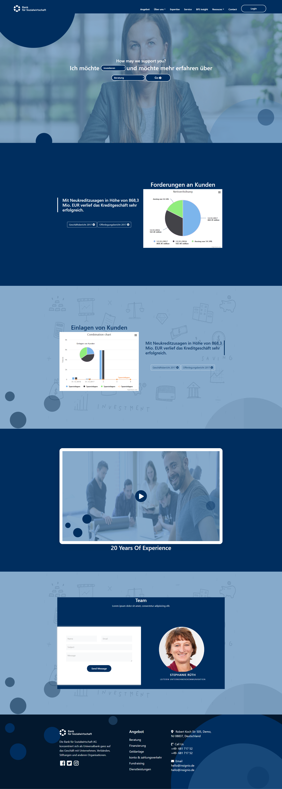

# Redesign-Insignio-Task
Redesigning and Implementation of a website assigned by the company

Technologies Used: HTML5, CSS3, JavaScript ES6, WebPAck, NPM, Babel, Polyfill, Highcharts, Bootstrap
MVC architecture(Model View Controller)

Demo: https://m90khan.github.io/Redesign-Insignio-Task/dist/index.html  

 
